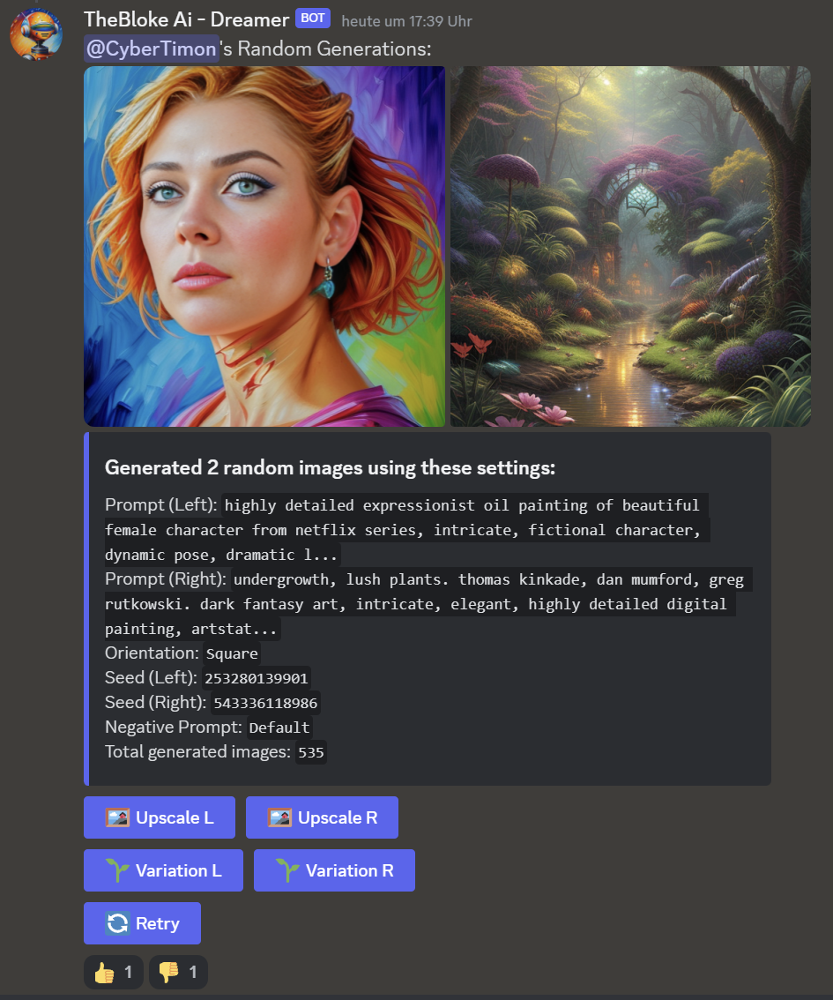
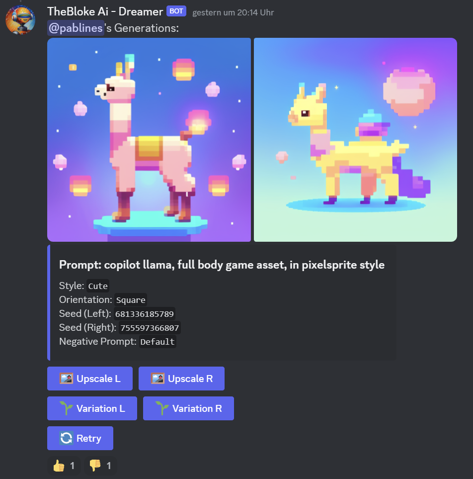
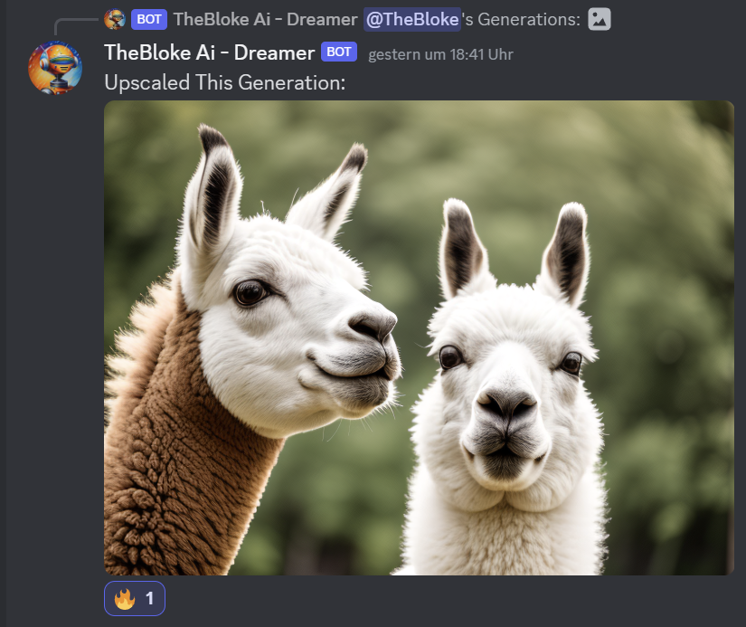

# Stable Diffusion Discord Bot
A python discord bot with many features which uses A1111 as backend and uses my prompt templates for beautiful generations - even with short prompts.

## Capabilities 
### Generation
- **Img2Img**: Upscale images 
- **Txt2Img**: create images from prompt 
- **Txt2Vid_1step**: creates animated sequence from prompt (AnimatedDiff lightning)  
- **Txt2Vid_2step**: create more controlled animations with initial picture preview
- **Img2Vid**: produced animations from picture input (SVD)

### Usage
- Retrying with the same settings
- Variation on images with variational seed
- Pre-made prompt templates for specific stylesj 
- Configuration for server and/or DM use in Discord
- Generate random image prompts using a finetuned GPT 2 which runs on cpu (Thanks to: FredZhang7/distilgpt2-stable-diffusion-v2)
- Queued image generation
- Video output in MP4 or GIF format

## How to use this repo
### Setup Overview (TL;DR version) 
- clone repo
- create virtual environment with python 3.10 (`python -m venv venv`) 
- activate the environment: `venv\Scripts\activate.bat`  (assuming Windows)
- install requirements: `pip install -r requirements.txt`
- install ComfyUI if not already installed (in separate environment and folder); see [ComfyUI Github](https://github.com/comfyanonymous/ComfyUI)
- load and run the workflows you want to use into ComfyUI and test each one
  - current definitions for this repo are stored in `./app/sd_apis/comfyUI_workflows`
  - you can adjust this directory path in the `bot_settings.json` file
  - it is important to make sure the workflow runs first in ComfyUI before running the bot.  There may be missing nodes in your workflow
- define your bot key in the `.env.development` or `.env.deploy` file
- define you specific model setups in the `bot_settings.json` as needed
- start ComfyUI. Make sure it is running on the specified host and port
- start the bot with `python bot.py`.  Slash commmand should become active in your Discord server where the bot has been added.

### More Detailed Setup Overview
First you need to install all the python dependencies:
`pip install -r requirements.txt`

This bot works with the ComfyUI API, accessed via socket.  You should have ComfyUI installed and running.  All required workflows
should be tested before adding to the bot definition.  The default defintion of `host: 127.0.0.1` and `port:8188`

#### 1. Bot Key
The bot key is stored in:
- `.env.development` : settings for development and testing 
- `.env.deploy` : settings for deployed bot
(copy the `.env.template` file for initial definition)

Most default settings can be kept, but you **must specify** the `BOT_KEY` which you obtain from the discord bot app setup. (You first have to create a discord bot at discord.com/developers/ but I won't explain this here. Just make sure that the bot has access to commands and can type messages / embed things. Don't forget to add the bot to your discord using the generated link in the devoloper portal with the correct rights, but I think that should be clear.  General instructions can be found on [RealPython: how to make a Discord bot](https://realpython.com/how-to-make-a-discord-bot-python/))

#### 2. Specifying model settings & workflows
All bot settings (other than the bot key) are stored in the `bot_settings.json` file.  To start, copy the example file from the `./examples/example_bot_settings.json` file. Rename this file to `bot_settings.json` and place in the root folder of this project (same folder as the `bot.py` file)

#### 3. Run the bot
Finally, start the bot using `python bot.py` - after this you can use the bot using `/generate` or `/generate_random` (alternate command names can be specified in `bot_settings.json` file). 

## Screenshots

